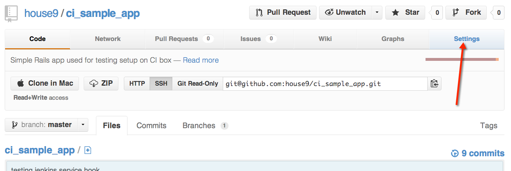
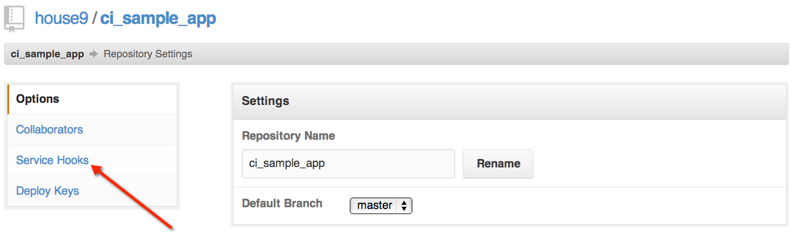
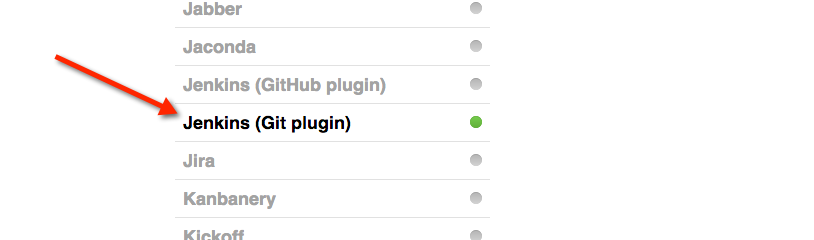
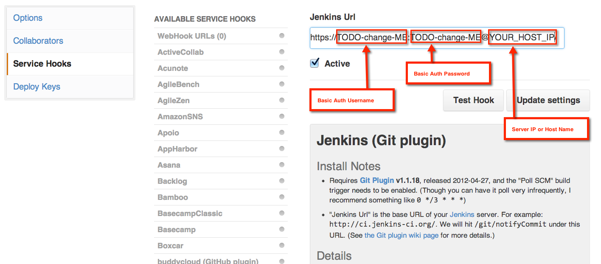

# Chef Recipe for Jenkins Rails CI

This repo contains recipes for provisioning a jenkins server set up to run CI for rails apps.

TODO: WIP

* pre-load with sample config for a rails project

## *Disclaimer and Alternatives*

All code used in this repo was written by a bunch of smart people (not me). I hobbled together bits, mostly from the lobot project while trying to gain more knowledge about how chef and knife work and made some small tweaks here and there.

```
If you want to run your CI on EC2, then you should use lobot!
```

* [https://github.com/pivotal/lobot](https://github.com/pivotal/lobot) 
* [http://www.confreaks.com/videos/1214-jucsf2012-jenkins-with-ruby-on-rails-on-ec2](http://www.confreaks.com/videos/1214-jucsf2012-jenkins-with-ruby-on-rails-on-ec2) 

### Hosted CI might be a better alternative for you?

* [https://semaphoreapp.com/](https://semaphoreapp.com/)
* [https://www.tddium.com/](https://www.tddium.com/)
* If you have an open source project - [https://travis-ci.org/](https://travis-ci.org/)
* [https://saucelabs.com/](https://saucelabs.com/)


## Why might you be interested in using this repo for your CI setup?

* DigitalOcean hosting: [https://www.digitalocean.com/pricing](https://www.digitalocean.com/pricing) is very reasonably priced

This project was tested against ubuntu 12.04 32-bit server hosted on DigitalOcean. After you sign up for a DigitalOcean account, I recommend uploading your public ssh key so that you can select it when provisioning a new server - avoiding the need for password authentication. NOTE: your ssh public key is usually going to be found at `~/.ssh/id_rsa.pub`

## What does this setup on your provisioned server?

* Jenkins server installed with the following plugins:
  * ruby-runtime
  * rake
  * rvm
  * etc... see (nodes/main.json - jenkins/plugins array)
* nginx with ssl and basic authorization so your CI is protected
* postgresql - for running your rails tests
* nodejs - for compiling your rails assets


## How to use

clone the repo to your local machine - `git clone https://github.com/house9/ci_chef_jenkins_rails.git`

cd into the repo, create a gemset if desired, then:

```
# install knife-solo and chef-librarian
bundle install

# install the cookbooks defined in Cheffile (NOTE: these are ignored in .gitignore)
librarian-chef install
```

* update the passwords in nodes/main.json
* provision your server: maybe you want to use vagrant locally or just go with a DigitalOcean provisioned server; either way you will need the IP or hostname of the server and a user with root privilages

```
# replace user and host - i.e. root@192.168.0.0
knife solo prepare user@host --omnibus-version=10.18.2 --node-name=main
# install recipes, could take some time...
knife solo cook user@host nodes/main.json --skip-chef-check
```

Once the recipes are installed you'll want to verify the server is up and running. Go to http://host in your browser, if everything was setup correctly you should get a warning that you are accessing an "Unstrusted Site" - this is because we are using a self-signed SSL certificate, since we created it - no worries, just add it to your browser exception list.

Set up Jenkins project configuration (AKA a Jenkins Job), note there is a sample one already deployed, you can fork - [https://github.com/house9/ci_sample_app](https://github.com/house9/ci_sample_app) and update the existing project configuration to point to your forked repo for testing.

* Click the "Build Now" link on the Jenkins Job

You will want updates to your repo to automatically kick off CI Builds, configure your github repo with a Service Hook, so that it will notifiy Jenkins when your repo changes. Follow the steps outlined in these screenshots:

<div style="text-align:center">
    
    
    
    
    
    
    
</div>

Now you should be good to go!

Check the sample job configuration which uses the same "Install Notes" from the "Jenkins (Git plugin)" Service Hook, you will need to add that step to any new Jenkins Jobs you add to your server.


## Random Notes...
bundle install gems
knife solo init .
librarian-chef init
knife solo prepare root@host --omnibus-version=10.18.2
knife solo cook root@host nodes/main.json --skip-chef-check

```
https://github.com/house9/ci_sample_app.git

bundle install
cp config/database.yml.jenkins config/database.yml
bundle exec rake db:drop
bundle exec rake db:create
bundle exec rake db:migrate
bundle exec rake db:test:prepare
bundle exec rake test
```

